# EC2를 사용하여 워드프레스 띄워보기

이 가이드는 Amazon EC2 가상 머신(인스턴스)에 설치된 WordPress를 이용하여 웹사이트를 가동하고 운영하는 방법을 다룹니다.
모든 작업은 프리티어에 해당합니다.

1. AWS Management Console에 로그인 후 서비스 - 컴퓨팅 아래에서 EC2를 찾아 대시보드를 엽니다.

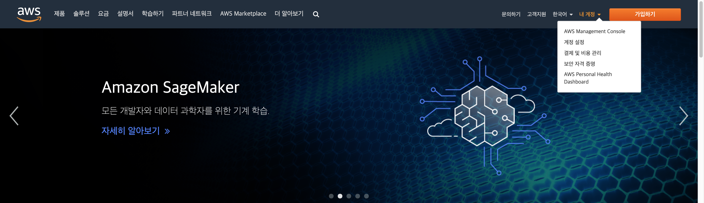
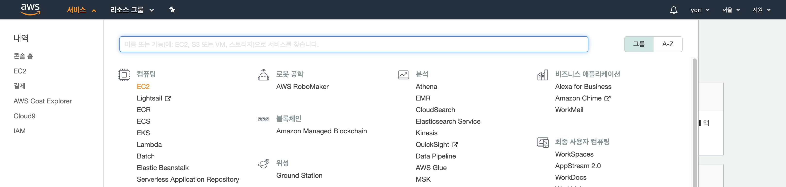

2. **Amazon EC2 인스턴스 시작**

  - EC2 대시보드 왼쪽에서 인스턴스를 클릭하고 인스턴스 시작을 선택하여 가상 머신을 생성합니다.

  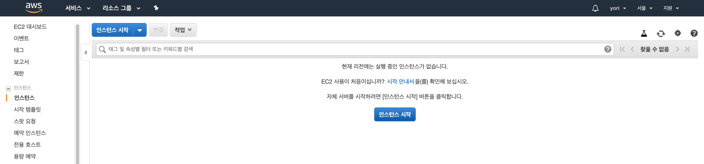

3. **인스턴스 구성**

  - AWS Marketplace에 WordPress가 이미 설치되어 있는 AMI(Amazon Machine Image)인 "WordPress Certified by Bitnami and Automattic"를 선택하고 Continue를 클릭합니다.

  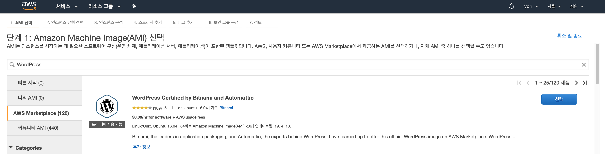

  - 인스턴스 유형은 t2.micro를 선택합니다. t2.micro는 1개의 vCPUs와 1GiB 메모리를 제공하며, 프리티어에서는 총 750시간을 무료로 사용할 수 있습니다. t2.micro 이외의 인스턴스는 과금이 되니 주의해주세요.

  - 인스턴스 세부 정보 구성은 기본값을 그대로 사용합니다.
    (IAM을 설정하기로 하면 추가 작성 예정)

  - 스토리지도 기본값을 사용합니다.

  - 태그 추가를 선택하고 Key : Value의 형식으로 입력해줍니다. 태그는 AWS 자원을 관리하기 위한 사용자 정의 Key, Value 쌍입니다. 예를 들어 Name: EC2-SookMyung-WordPress, Owner: KSY가 태그로 등록되어 있다면 Owner가 KSY인 EC2 자원을 검색하는 쿼리 등을 통해 쉽게 자원을 관리할 수 있습니다.

  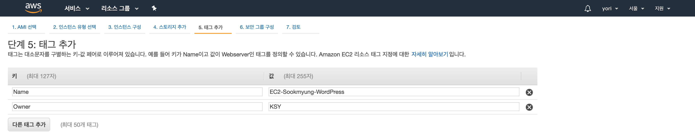

  - 보안 그룹 설정은 기본값을 사용합니다.
    (SSH Access IP를 설정하기로 하면 추가 작성 예정)

  - 검토 및 시작을 선택하고 지금까지 설정한 구성을 확안힙니다. 이상이 없다면 시작하기를 클릭해주세요.

  - EC2 인스턴스에 직접 접근하기 위해서는 반드시 키 페어가 필요합니다. 키 페어를 생성하고 다운로드 해주세요. 키 페어는 나중에 다시 다운받을 없으며, 분실시 해당 인스턴스에 다시 접근할 수 없습니다. 기존 키 페어가 있는 경우에는 새로 생성하지 않고 사용할 수 있습니다.
  > AWS에서는 키 페어를 .ssh 하위 디렉토리에 저장하는 것을 권장하고 있습니다.

  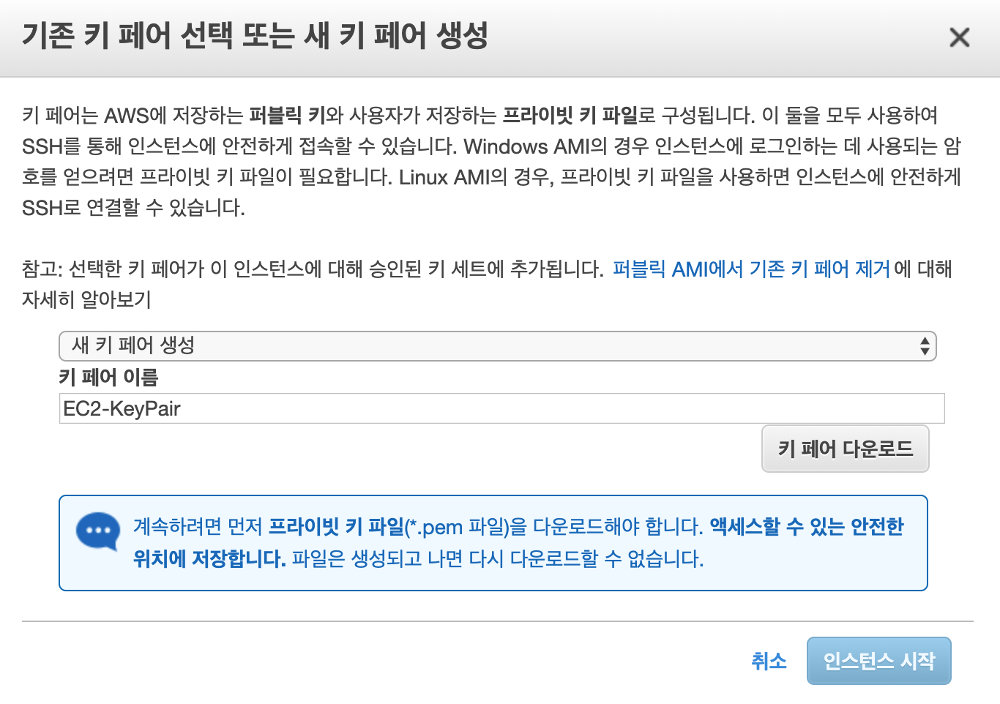

4. **WordPress 접속**

  - Instanse State가 Running으로 바뀌었다면 Public IP를 확인하고 접속합니다.

  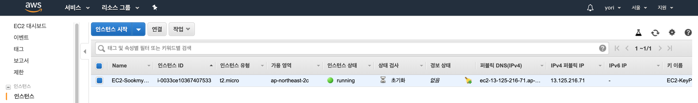

5. **WordPress 사용자 정의**

  - WordPress 관리 페이지에 로그인하기 위해서는 사용자를 정의해야 합니다. 암호를 찾기 위해서 생성한 인스턴스의 설정을 클릭하고 시스템 로그 가져오기를 선택합니다. 그리고 로그 아래쪽에 있는 해쉬 암호를 복사합니다.
  
  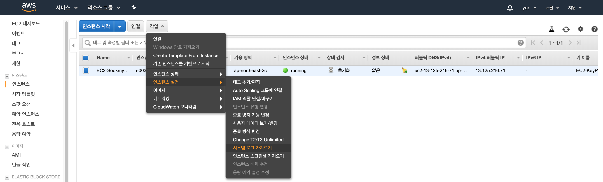
  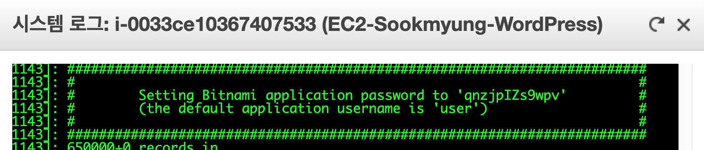

6. **WordPress 로그인**

  - publicip 뒤에 /admin을 추가하고 로그 파일에서 확인한 사용자 이름 user와 암호를 입력합니다.

  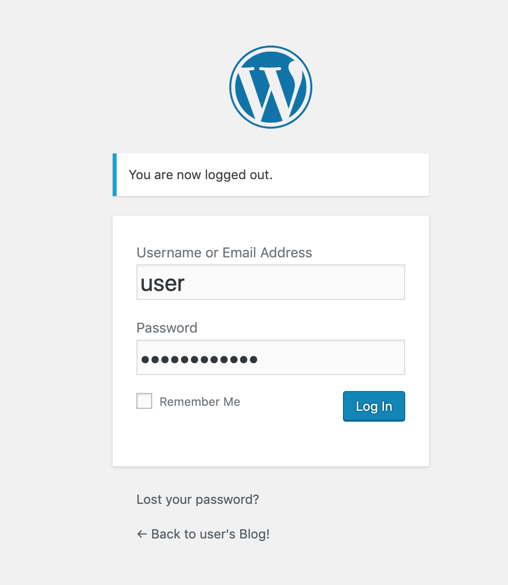

6. **WordPress 글 작성하기**

  - 왼쪽 대시보드의 Posts - Add New를 클릭하고 제목과 내용을 작성한 후 Publish를 클릭합니다.

  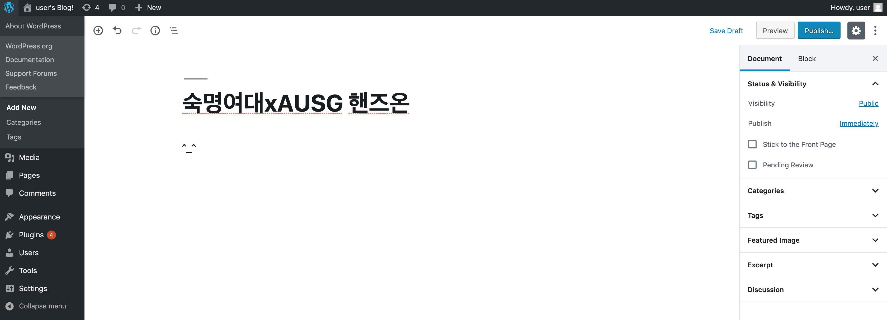

**고생하셨습니다. 다음 RDS 부스로 이동해주세요!**

해당 실습 가이드는 https://github.com/AUSG/aws-univ-expo/ec2 에서 확인할 수 있습니다.