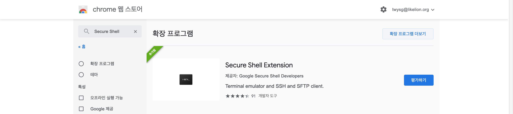
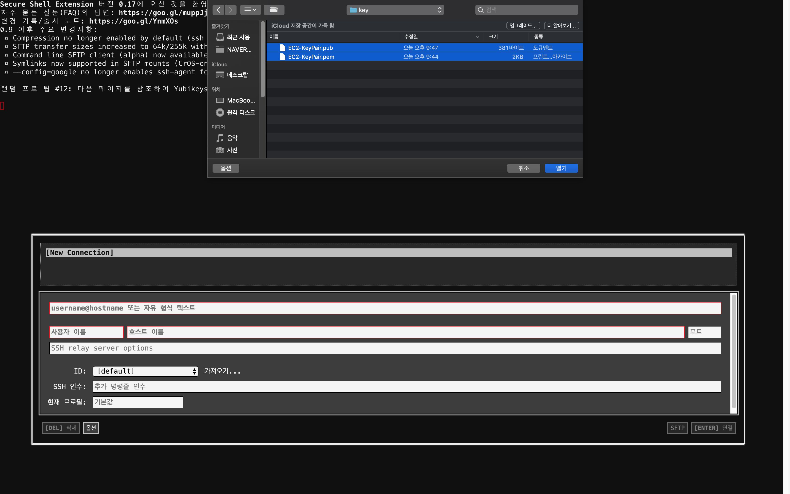
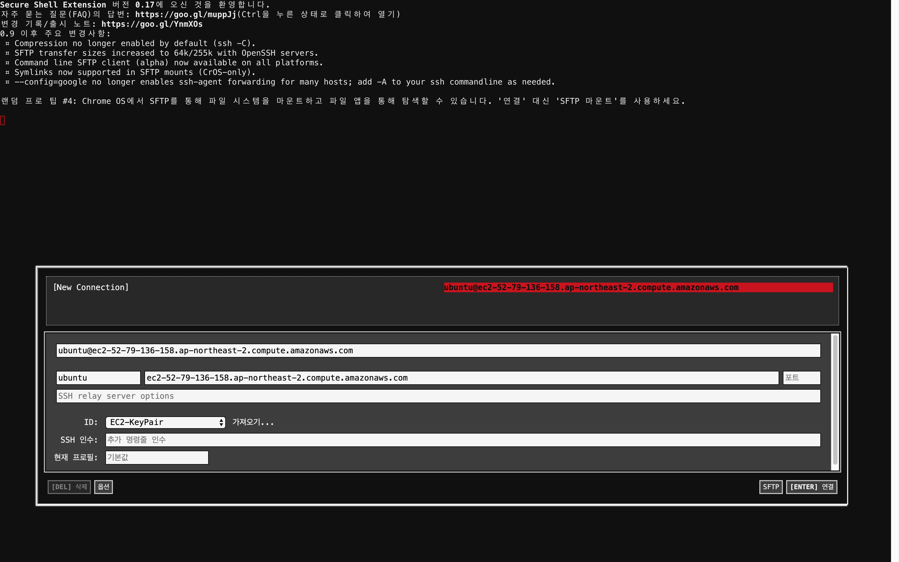

## 숙명여대와 함께하는 AWS Univ. Expo 핸즈온

😎 **AUSG** 핸즈온에 오신 것을 환영합니다.

핸즈온에서는 EC2를 사용하여 워드프레스를 실행시키고, RDS를 연동하여 직접 데이터를 저장하는 과정과 마지막으로 S3를 사용하여 정적 파일을 업로드하는 과정을 실습합니다.

실습에 이용되는 서비스는 프리티어 내에서 진행되며, 마지막 S3 부스에서 생성한 모든 서비스를 삭제하는 실습이 진행될 예정입니다. 불필요한 과금을 피하기 위해 S3 부스를 반드시 방문해주세요!

## EC2를 사용하여 워드프레스 띄워보기

이 가이드는 Amazon EC2 가상 머신(인스턴스)에 설치된 WordPress를 이용하여 웹사이트를 가동하고 운영하는 방법을 다룹니다.
모든 작업은 프리티어에 해당합니다.

**1. AWS Management Console에 로그인 후 서비스 - 컴퓨팅 아래에서 EC2를 찾아 대시보드를 엽니다.**

**2. Amazon EC2 인스턴스 시작**

- EC2 대시보드 왼쪽에서 인스턴스를 클릭하고 인스턴스 시작을 선택하여 가상 머신을 생성합니다.

**3. 인스턴스 구성**

- AWS Marketplace에 WordPress가 이미 설치되어 있는 AMI(Amazon Machine Image)인 "WordPress Certified by Bitnami and Automattic"를 선택하고 Continue를 클릭합니다.

- 인스턴스 유형은 t2.micro를 선택합니다. t2.micro는 1개의 vCPUs와 1GiB 메모리를 제공하며, 프리티어에서는 총 750시간을 무료로 사용할 수 있습니다. t2.micro 이외의 인스턴스는 과금이 되니 주의해주세요.

- 인스턴스 세부 정보 구성은 기본값을 그대로 사용합니다.

- 스토리지도 기본값을 사용합니다.

- 태그 추가를 선택하고 Key : Value의 형식으로 입력해줍니다. 태그는 AWS 자원을 관리하기 위한 사용자 정의 Key, Value 쌍입니다. 예를 들어 Name: EC2-SookMyung-WordPress, Owner: KSY가 태그로 등록되어 있다면 Owner가 KSY인 EC2 자원을 검색하는 쿼리 등을 통해 쉽게 자원을 관리할 수 있습니다.

- 보안 그룹 설정은 기본값을 사용합니다.

- 검토 및 시작을 선택하고 지금까지 설정한 구성을 확안힙니다. 이상이 없다면 시작하기를 클릭해주세요.

- EC2 인스턴스에 직접 접근하기 위해서는 반드시 키 페어가 필요합니다. 키 페어를 생성하고 다운로드 해주세요. 키 페어는 나중에 다시 다운받을 수 없으며, 분실시 해당 인스턴스에 다시 접근할 수 없습니다. 기존 키 페어가 있는 경우에는 새로 생성하지 않고 사용할 수 있습니다.

  > AWS에서는 키 페어를 .ssh 하위 디렉토리에 저장하는 것을 권장하고 있습니다.

  

**4. WordPress 접속**

- Instance State가 Running으로 바뀌었다면 Public DNS(IPv4)를 확인하고 접속합니다.

**5. SSH를 사용하여 EC2에 접속하기**

- WordPress 관리 페이지에 로그인하기 위해서는 사용자를 정의해야 합니다. 초기화된 비밀번호는 EC2 대시보드의 시스템 로그를 통해서도 확인할 수 있지만 RDS 부스에서 사용하게 될 SSH(Secure Shell)를 통해 EC2에 접속하여 비밀번호를 확인해보겠습니다. 본인의 환경에 맞는 방법을 선택해주세요.

- Windows

  - Windows에서 SSH를 사용하려면 Putty 또는 OpenSSH이 설치된 PowerShell이 필요합니다. 해당 실습에서는 접근성을 위해 Secure Shell이라는 Chrome Extension을 사용합니다.
  - 크롬 확장프로그램에 Secure Shell을 검색하고 설치해주세요.

  

  - CMD를 열고 키 페어가 설치된 디렉토리로 이동 후 다음 명령어를 입력합니다.

    - `$ chmod 400 EC2-KeyPair.pem`
    - `$ ssh-keygen -y -f EC2-KeyPair.pem > EC2-KeyPair.pub`
    - `$ copy EC2-KeyPair.pem EC2-KeyPair`

  - 명령어를 입력했다면 설치된 확장프로그램에서 Secure Shell을 클릭한 후 연결 대화상자로 들어갑니다.  
  사용자 이름에는 ubuntu, 호스트 이름에는 Public DNS를 입력해주세요. 그리고 다음과 같이 가져오기를 클릭 후 키 페어가 저장된 폴더에서 두 개의 EC2-KeyPair 파일을 불러옵니다. (.pem 확장자가 없는 파일과 .pub 확장자를 가진 파일 2개)

  

  - 위의 과정을 완료했다면 다음과 같은 화면을 볼 수 있습니다.

  

  - 연결을 클릭하고 "Are you sure you want to continue connecting (yes/no)?"라는 문구가 나오면 yes를 입력합니다.

  - `$ cat ./bitnami_credentials`를 입력하고 username과 password를 확인합니다.

- MacOS 또는 Linux

  - 터미널을 열고 키 페어가 저장된 디렉토리로 이동한 후 다음 명령어를 입력합니다.

    - `$ chmod 400 EC2-KeyPair.pem`
    - `$ ssh -i "EC2-KeyPair.pem" ubuntu@<public_dns>`

  - "Are you sure you want to continue connecting (yes/no)?"라는 문구가 나오면 yes를 입력합니다.

  - `$ cat ./bitnami_credentials`를 입력하고 username과 password를 확인합니다.

**6. WordPress 로그인**

- Public DNS 뒤에 /admin을 추가하고 SSH를 통해 확인한 사용자 username과 password를 입력합니다.

  

**7. WordPress 글 작성하기**

- 왼쪽 대시보드의 Posts - Add New를 클릭하고 제목과 내용을 작성한 후 Publish를 클릭합니다.

**고생하셨습니다. 다음 RDS 부스로 이동해주세요!**

해당 실습 가이드는 https://github.com/AUSG/aws-univ-expo/ec2 에서 확인할 수 있습니다.
