## 숙명여대와 함께하는 AWS Univ. Expo 핸즈온

😎 **Awskrug Univsersity Student Group (AUSG)** 핸즈온에 오신 것을 환영합니다.

핸즈온에서는 EC2를 사용하여 워드프레스를 실행시키고, RDS를 연동하여 직접 데이터를 저장하는 과정과 마지막으로 S3를 사용하여 정적 파일을 업로드하는 과정을 실습합니다.

실습에 이용되는 서비스는 프리티어 내에서 진행되며, 마지막 S3 부스에서 생성한 모든 서비스를 삭제하는 실습이 진행될 예정입니다. 불필요한 과금을 피하기 위해 S3 부스를 반드시 방문해주세요!

---

## RDS를 사용하여 워드프레스의 데이터 연동해보기

#### :fire: 이번 세션은 EC2를 생성하며 기본으로 생성된 wordpress의 데이터베이스를 RDS로 연동하는 방법에 대해 알아봅니다. 따라서, EC2 세션을 아직 진행하지 않았다면, [EC2 세션](../ec2/readme.md)부터 진행해주세요.

EC2 세션 - <https://github.com/AUSG/aws-univ-expo/tree/master/ec2

### 1. RDS 데이터 베이스 생성

기존에 있던 관리자 콘솔에서 **RDS를** 선택해주세요. `데이터베이스 생성` 버튼을 클릭해주세요.

- 엔진 옵션: MySQL 
- 버전: MySQL 5.7.22
- 템플릿: **프리티어** (과금을 방지하기 위해 **반드시 **프리티어 범위 내에서만 사용합니다)
- 설정
  - DB 인스턴스 식별자: my-wordpress-db-instance (customize 가능)
  - 자격 증명 설정 (customize 가능)
    - **Master username**: admin
    - **Master password**: admin1234
- DB 인스턴스 크기: **db.t2.micro** 

- 연결

  - VPC - defualt VPC
  - 추가 연결 구성
    - 퍼블릭 액세스 가능: 예
    - VPC 보안 그룹: 기존 보안 그룹 (EC2 생성 시 만들어진 보안 그룹 선택)

  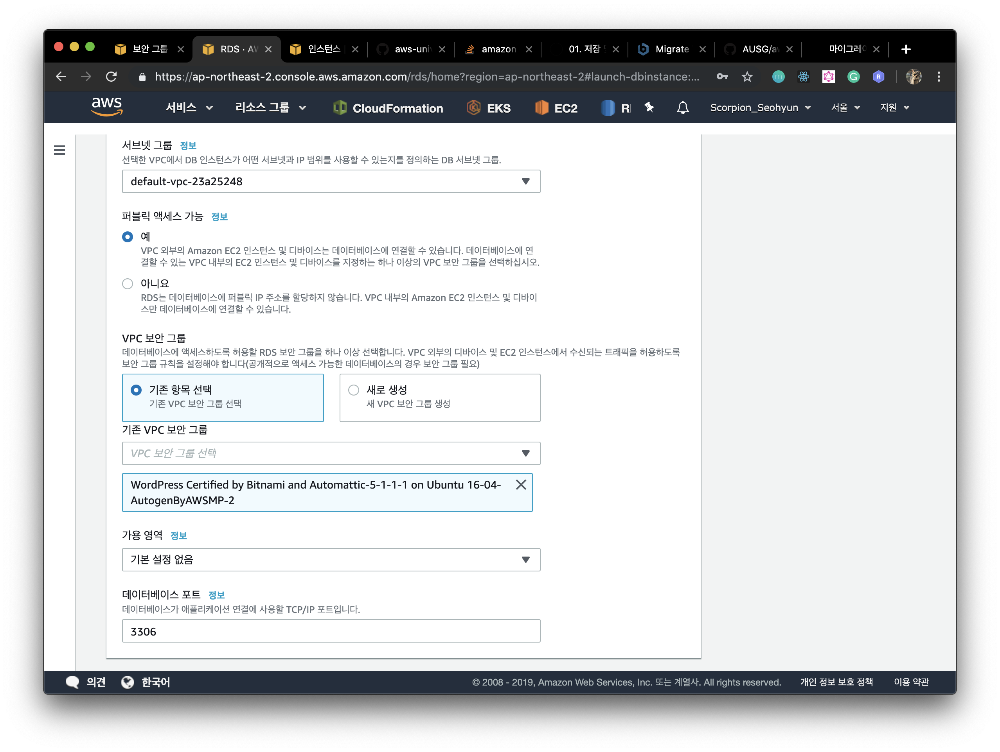

  다음과 같이 설정 후, **데이터베이스 생성** 버튼을 눌러주세요. 생성된 인스턴스를 클릭하여 `연결&보안` 에서 **엔드포인트**가 생성되었는지 확인하고, **url을 복사**해주세요.

  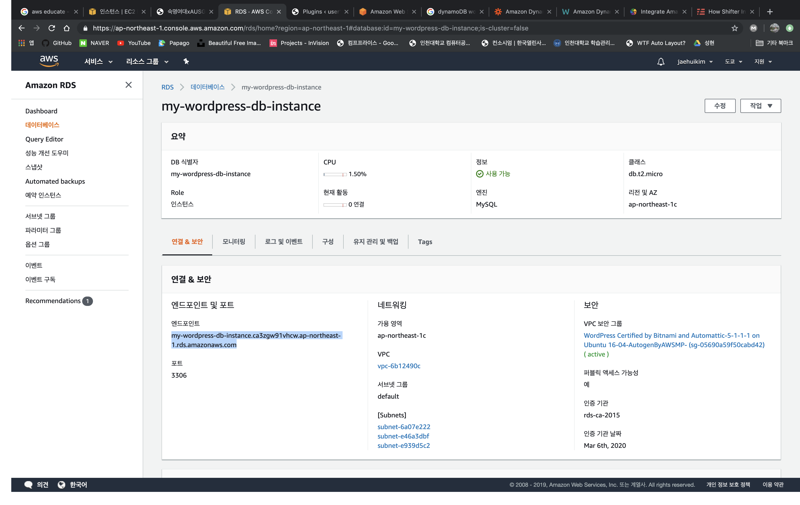

  엔드포인트가 생성되었다면, 다음과 같이 엔드포인트 주소를 복사해주세요. 나중에 쓰이니 꼭! 위치를 기억해주세요

  

### 2. 보안그룹 엑세스 사용

데이터베이스 인스턴스가 실행되면 MySQL 데이터베이스 서버에 대한 원격 액세스를 허용해야합니다. 관리자 콘솔에서 **EC2**를 선택해주세요. 좌측 메뉴에서 `네트워크 및 보안 탭`의 `보안 그룹`을 선택해주세요.

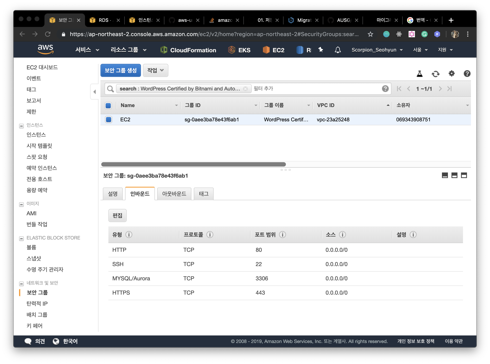

이전 단계에서 생성한 EC2의 보안그룹을 선택하고, 하단의 인바운드, 편집 버튼을 눌러주세요. 원격 엑세스를 허용하기 위해 다음과 같이 작성해주세요. 실습의 원활한 진행을 위해 모든 IP에서 엑세스할 수 있도록 지정해주세요.

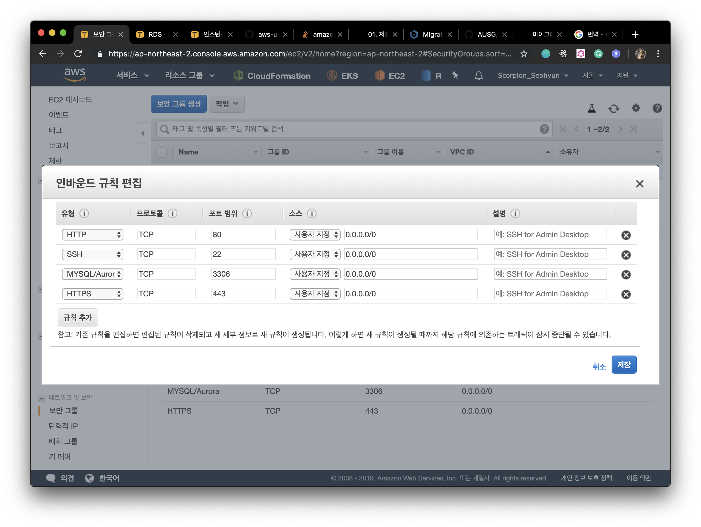


### 3. EC2 인스턴스 엑세스하여 기존 Database 내보내기

생성된 EC2 인스턴스에 엑세스해봅시다. EC2 대시보드에서 ` 인스턴스` 를 선택한 후, 이전 단계에서 생성한 EC2를 선택해주세요. 상단의 `연결` 버튼을 누르면 다음과 같은 화면을 볼 수 있습니다. MacOS 나 Linux 환경이시라면 바로 터미널을 열어주시고, 윈도우 환경이라면 EC2 부스에서 설치하였던 **Git Bash** 를 열어 환경을 세팅해주세요. 

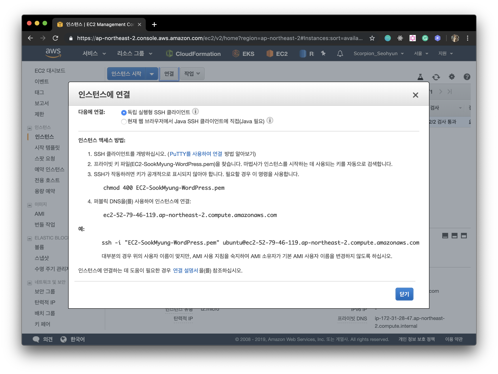

이전 단계에서 생성한 프라이빗 키 파일이 저장된 경로로 이동해 다음 명령어를 입력해주세요. 다음과 같은 화면을 통해 인스턴스에 연결된 것을 확인할 수 있습니다.

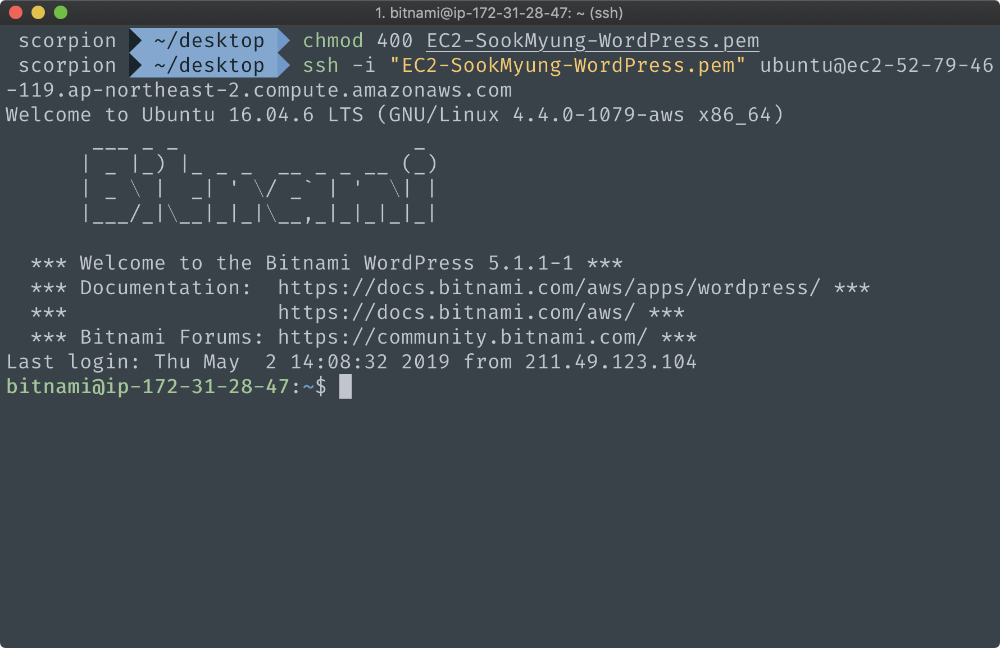


이제, 기존의 Databse를 확인해보도록 하겠습니다. EC2의 퍼블릭 IP 주소뒤에 /phpmyadmin을 통해 접속할 수 있습니다. 하지만, 보안상의 문제로 로컬에서만 접속이 가능하다는 에러(`For security reasons, this URL is only accessible using localhost (127.0.0.1) as the hostname`)가 발생하는 것을 볼 수 있습니다. 권한을 설정해보도록 하겠습니다. 


위에서 진행하던 터미널에서 계속 진행해주세요. 

```shell
현재 경로: /home/bitnami/
$ cd apps/phpmyadmin/conf
$ vi httpd-app.conf
```

vi 편집기를 통해, 해당 파일을 다음과 같이 수정해주세요. (`수정하기` i `저장 후 종료` ZZ `vi 종료` :q )

- Allow from 127.0.0.1 —> **Allow from all**
- Require local —> **Require all granted**

```
// 파일명: httpd-app.conf
<Directory "/opt/bitnami/apps/phpmyadmin/htdocs">
~~~ 생략
<IfVersion < 2.3 >
Order allow,deny
Allow from all	// 이 부분 수정
Satisfy all
</IfVersion>
<IfVersion >= 2.3>
Require all granted // 이 부분 수정
</IfVersion>
ErrorDocument 403 "For security reasons, this URL is only accesible using localhost (127.0.0.1) as the hostname"
</Directory>
```

관리자 콘솔에서 EC2 인스턴스에 들어와주세요. 그리고 인스턴스 재부팅을 한번 해주세요.

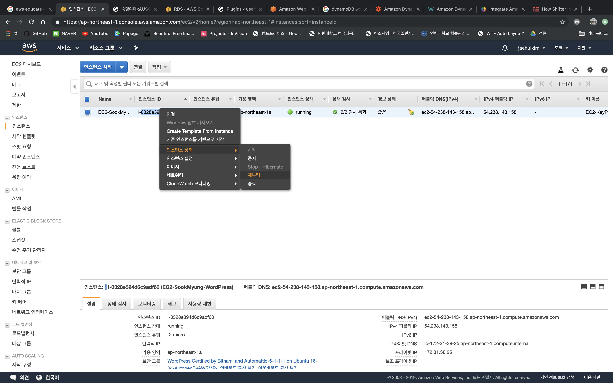

이제 원격으로 접속 가능합니다. 퍼블릭 IP주소 뒤에 /phpmyadmin을 입력해보세요. 하지만 기존에 생성된 DB에 대한 정보를 알아야 phpmyadmin에 접근할 수 있습니다.

EC2의 재부팅으로 인해 접속이 끊겼기에 위의 순서대로 다시 접속해주세요. 

```shell
현재 경로: /home/bitnami
$ cd apps/wordpress/htdocs 
$ vi wp-config.php
```

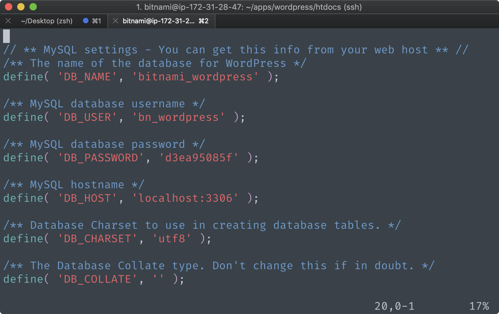

여기에 적힌 **DB_USER** 정보와 **DB_PASSWORD** 정보를 입력하면 phpmyadmin에 접속할 수 있습니다.

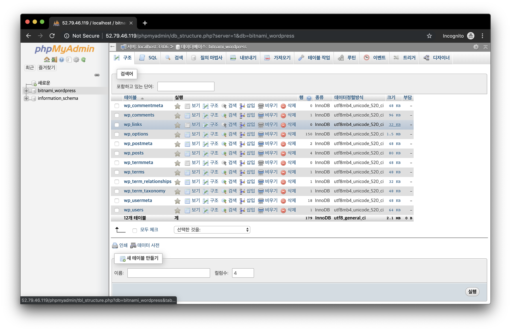

**bitnami_wordpress**를 선택하고, 상단의 **내보내기** 버튼을 누른 후, 실행을 눌러주세요. 그 후 생성되는 파일을 프라이빗 키 파일이 저장된 경로에 잘 저장해두세요. 


### 4. 기존 Database를 RDS에 연결하기

```shell
현재 경로: /home/bitnami/apps/phpmyadmin
$ cd htdocs
$ vi config.inc.php
```

vi 편집기로 연 문서의 **맨 밑**으로 내려가 아래 내용을 넣어주세요. 꼭 **생성한 RDS 엔드포인트 주소** 넣는 것을 잊지마세요! 

(생성한 RDS 엔드포인트 주소는 관리자 콘솔 - RDS - 데이터베이스 - 연결 & 보안에서 확인할 수 있습니다.)

```
// 파일명: config.inc.php
$i++;
$cfg['Servers'][$i]['verbose'] = 'Amazon RDS';
$cfg['Servers'][$i]['host'] = '생성한 RDS 엔드포인트 주소';
$cfg['Servers'][$i]['port'] = '3306';
$cfg['Servers'][$i]['socket'] = '';
$cfg['Servers'][$i]['connect_type'] = 'tcp';
$cfg['Servers'][$i]['extension'] = 'mysqli';
$cfg['Servers'][$i]['auth_type'] = 'cookie';
$cfg['Servers'][$i]['AllowNoPassword'] = false;
```

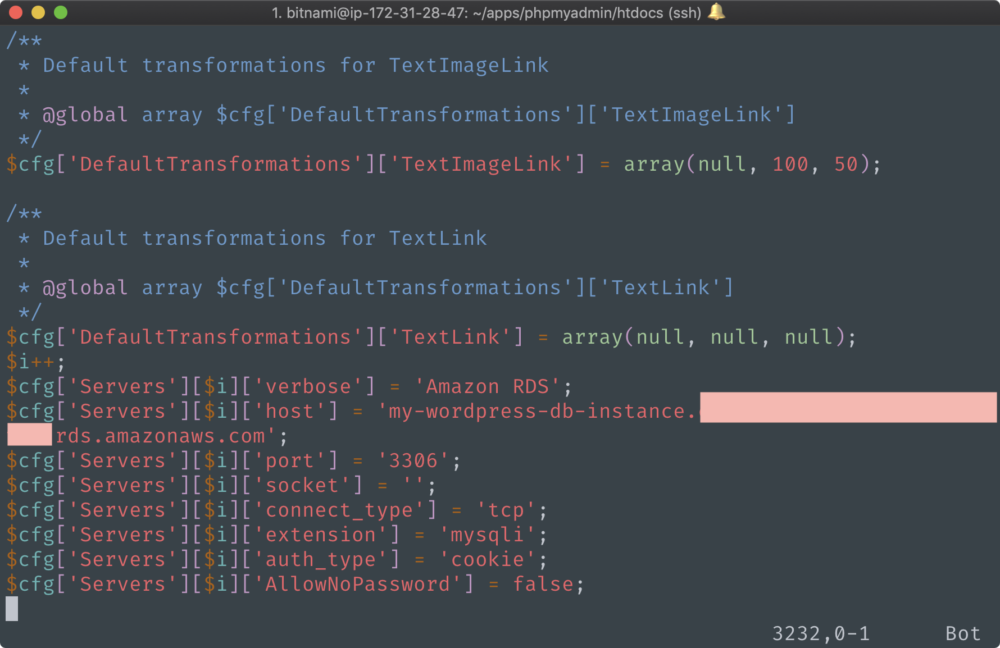


만약 `"config.inc.php" is read-only (add ! to override)` 와 같은 에러가 발생하여 수정할 수 없다는 에러메세지를 보셨다면 다음과 같은 절차를 통해 진행해주세요.

```shell
$ sudo vi config.inc.php
여기서 직접 내용 변경 후 저장해주세요.
```


기존에 접속하였던 localhost phpmyadmin에서 로그아웃을 하고, 이제 새로 생성된 Amazon RDS에 접속해봅시다.

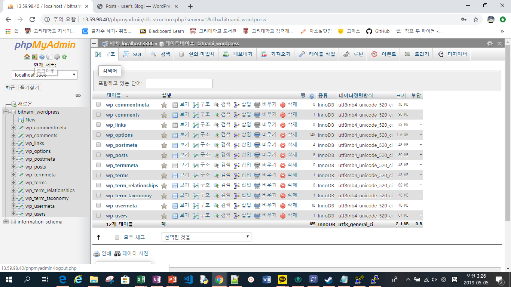

다시 접속을 해보면 다음 화면과 같이 **Amazon RDS**로도 접속을 할 수 있는 것을 볼 수 있습니다.  RDS를 생성할 때 설정하였던 master 사용자명과 암호를 입력하면 실행할 수 있습니다. (사용자명과 암호는  관리자 콘솔 - RDS - 데이터베이스 - 연결 & 보안)


phpmyadmin에 접속한 후, 새로운 데이터베이스 wordpress (원하는 이름으로 customize 가능)를 생성해주세요. 

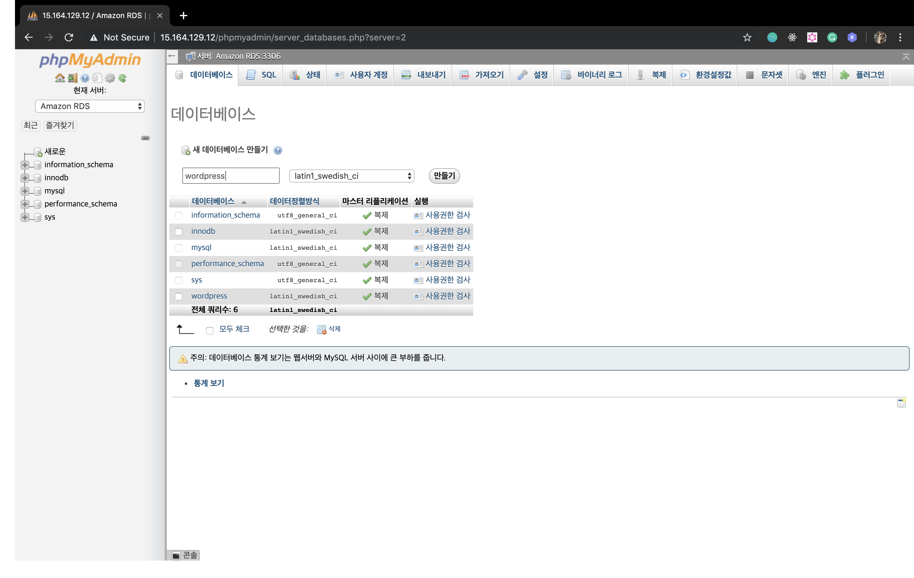


그 후,  기존에 백업해두었던 bitnami_wordpress.sql파일을 업로드해줍니다. **가져오기** 탭을 선택한 후, **choose File ** 버튼을 눌러 해당 파일을 업로드해주세요.


이제 마지막으로 wordpress 서버와 RDS를 연결하기 위해 wordpress의 config 설정해보도록 합시다.

이전에는 EC2에서 자체적으로 생성된 DB가 연결되어있었지만 이제는 RDS를 연결해야합니다.

```shell
현재 경로: /home/bitnami/
$ cd apps/wordpress/htdocs 
$ vi wp-config.php
```

다음과 같이 작성해주세요.
```
/** The name of the database for WordPress */
define( 'DB_NAME', '생성한 DB 이름' );

/** MySQL database username */
define( 'DB_USER', 'RDS Master 사용자 이름' );

/** MySQL database password */
define( 'DB_PASSWORD', 'RDS Master 사용자 암호' );

/** MySQL hostname */
define( 'DB_HOST', '생성된 RDS Endpoint주소:3306' );
```

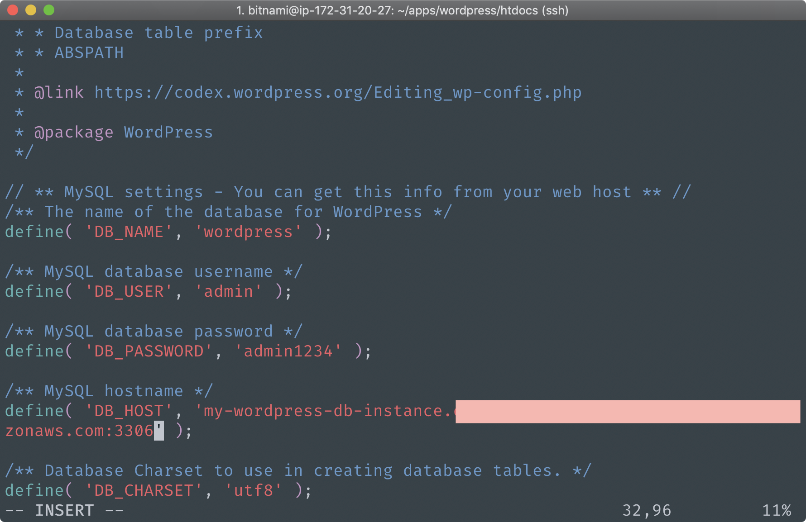


### 5. WordPress에서 글 작성해보기

이제 RDS가 잘 연결되었는지 확인하기 위해 워드프레스에서 글을 써보도록 합시다.

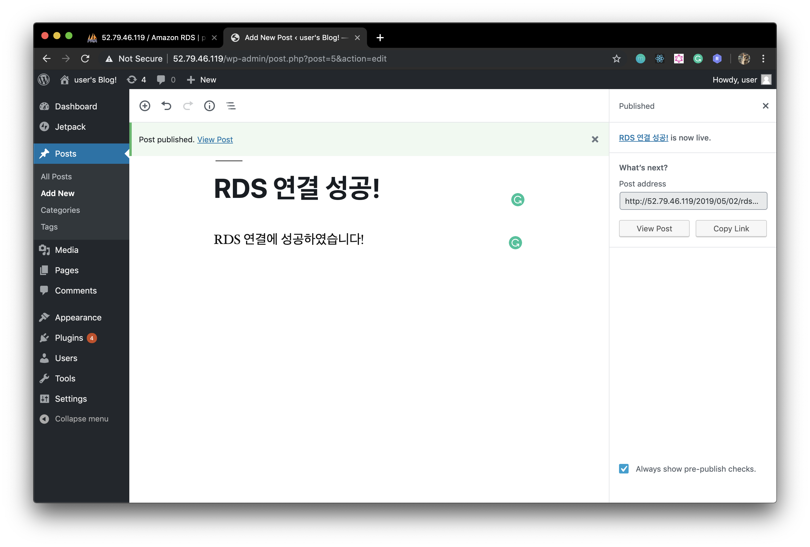

이 글이 RDS에 잘 저장되었는지 phpMyAdmin에서 확인해봅시다. 좌측 DB 종류에서 wordpress를 클릭한 후, wp_posts를 눌러보면 현재 wordpress에 저장된 글 목록을 볼 수 있습니다. 잘 저장된 것을 확인할 수 있습니다.

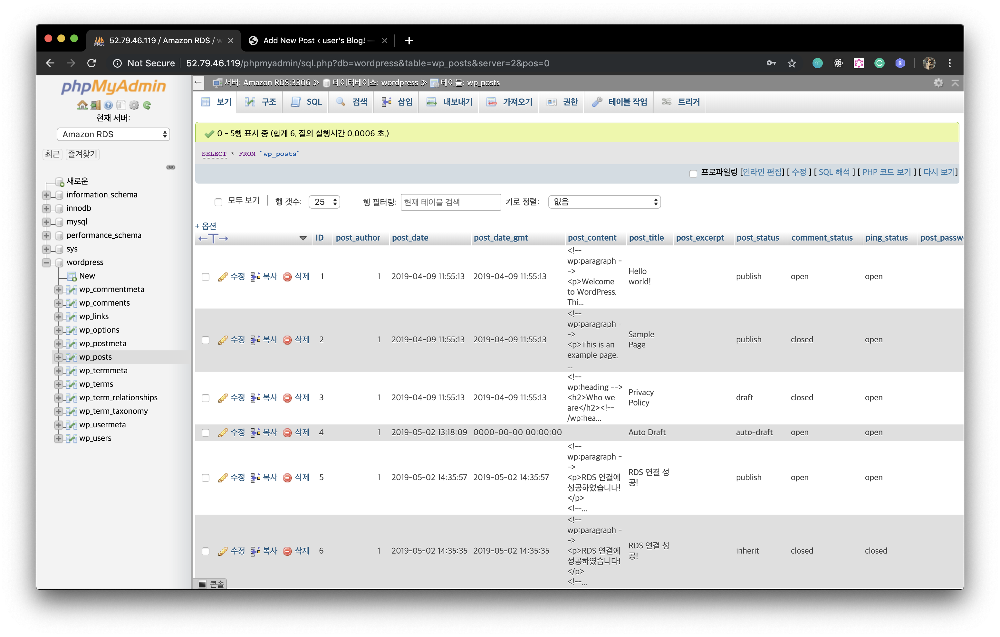

**고생하셨습니다. 다음 세션인 [S3 세션](../s3/README.md)으로 이동해주세요. :slightly_smiling_face:**

해당 실습 가이드는 https://github.com/AUSG/aws-univ-expo/tree/master/rds 에서 확인할 수 있습니다.

S3세션 - <https://github.com/AUSG/aws-univ-expo/tree/master/s3>

